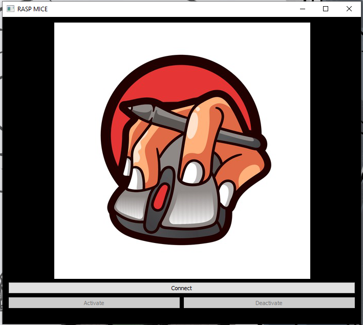

# MyPi
MyPi is a very simple yet powerful technique to control the mouse over IP using Raspberry pi. It is a over-engineered plug and play device which can convert any USB based Mouse(Wired or Wireless) to an IP Mouse. An IP Mouse is basically an Interent Protocol device which can connect to your PC over a WiFi connection and can control your device wirelessly in real time.

## Features
- Multi Platform(Windows/macOS) 
- Simple UI 
- Minimum Latency
- Its cost can be as low as Rs 1299(https://robu.in/product/raspberry-pi-zero-w/)

## Requirements
- Raspberry Pi with Raspbian installed on it.
- USB Mouse
- WiFi Connection

## DIY
* Install the Server.py and Screen.py file in your Raspberry Pi and set it to execute at startup. 
* Connect the USB Mouse to your Raspberry Pi.
* Ensure both the Raspberry Pi and your computer is connected to the same WiFi.
* Launch the MyPi.exe( or MyPi.app) in your computer.
<p align="center">

 </p>
- Click on Connect to automatically connect to your Raspberry pi.
- Now, Click on Activate to control your computer using the IP Mouse.

Implementation using Python Scripts

## Installation
From source:
```
git clone https://github.com/rockysaikia730/MyPi
cd MyPi
```
```
pip install pyautogui, pynput
pip install sockets
pip install pyqt5
```
For conda:
```
conda install -c anaconda pyqt
```
## Inference

Sensitivity: The Default Sensitivity adjusts by upscaling/downscaling with respect to the Raspberry Pi Default Resolution.
**Keep the Default Resolution of Raspberry Pi to 1920✕1080**
The Sensitivity Can be changed by changing the following variables:
```
scale_height = int(device_height/max_height_device) #Along y-direction
scale_width = int(device_width/max_width_device)    #Along x-direction
```

Latency: The Latency can be adjusted by the following method:
**The Default Value of PAUSE for PyAutoGUI is 0.1. So, it is recommended to decrease the PAUSE value**
```
pyautogui.PAUSE=0.001
```
To Run the python file:
```
python MyPi.py
```
## RaspberryPi Configuration

Instead of decoding the raw data from the mouse we track the cursor movements and events in the RaspberryPi so as to map the mouse movement to cursor movement on the screen. To allow similar tracking of mouse clicks, we initiate a full screen blank window so that the mouse clicks don't interact with the Raspberry Pi Desktop.
To run the files manually on RaspberryPi:
Load the Server.py and Screen.py on RaspberryPi. 
- Terminal 1
```
python Server.py 
```
- Terminal 2
```
python Screen.py
```

## Executables
To run as standalone application
## .app in macOS
```
pip install pyinstaller
```
```
pyinstaller --add-data '0.jpg:.' MyPi.py
pyinstaller MyPi.spec
```
```
mkdir appfolder
```
* Copy all the contents of dist/MyPi/ and paste it to appfolder
* Rename appfolder to **MyPi.app**

## .exe in Windows
```
pip install pyinstaller
```
Use pyinstaller to convert into .exe :
```
pyinstaller --onefile --windows --icon=logo.ico MyPi.py
```
